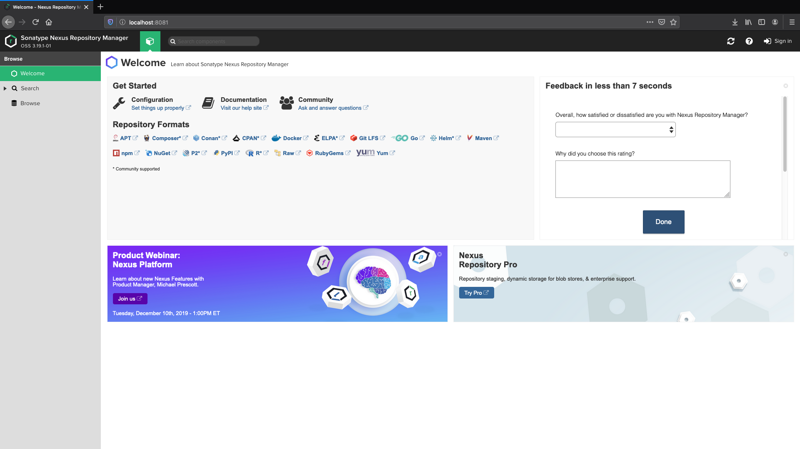
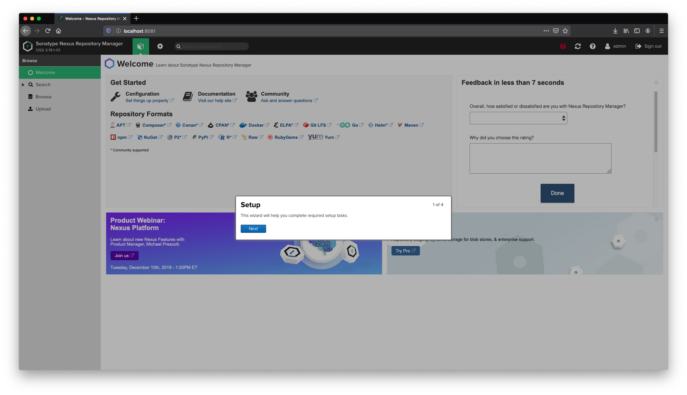
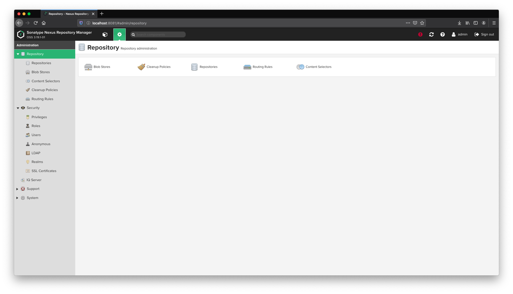
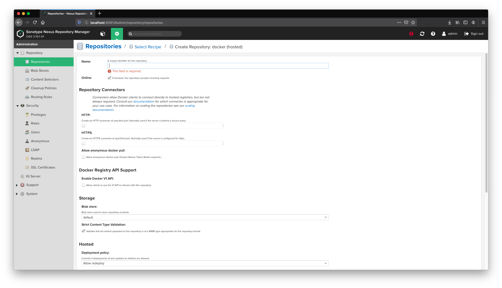
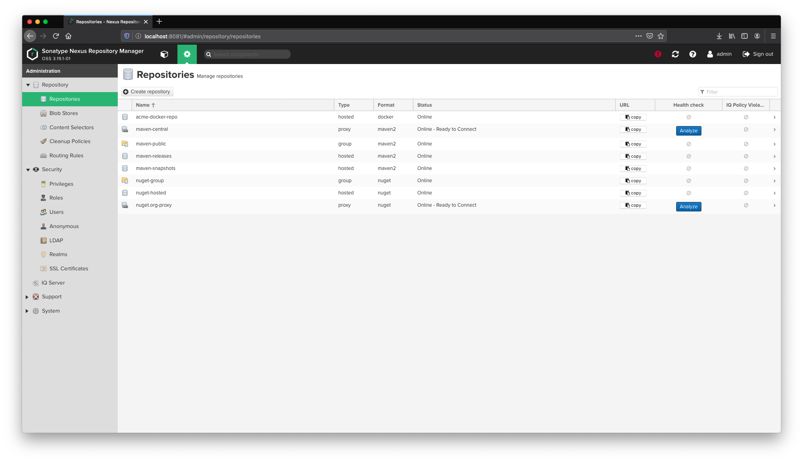

# Nexus 3 with Docker Registry

This project is responsible for mounting a basic **Docker registry** on a **Sonatype Nexus 3** platform

https://hub.docker.com/r/sonatype/nexus3/#user-content-persistent-data


## Technological Stack

* Java 8
* [Docker](https://www.docker.com/) - Container Technology
* [Docker Hub](https://hub.docker.com/) - Repositorio Docker Public 


## Prerequisites

Define what elements are needed to install the software

* Java 8 installed (1.5+ version required)
* Maven installed  (3+)
* Docker installed (19+)


### Installation

N/A


## Testing

N/A


## Deploy

1. Execute the following command

Create a Docker Container 

```bash
docker run -d -p 8081:8081 --name nexus sonatype/nexus3
```

2. Verify exist container created

```bash
docker ps -a
```

3. Verify app

```bash
http://localhost:8081/
```




4. Verify IP

```bash
docker inspect nexus | grep "IPAddress"
```

For example : 172.17.0.2


## Use

### Login

The first time you connect to the container and try to log into the application the following message is displayed:

Your admin user password is located in /nexus-data/admin.password on the server.

1. Execute the following command

```bash
docker exec -it nexus bash
```

2. Access the route /nexus-data/

3. Show the contents of the file

```bash
cat admin.password
```

Write down the password (For example : 066108a5-f457-41c9-93cd-bb28bdd56226)

4. Test login

* User : admin
* Password : <PASSWORD> 



Wizard Operations :

* Change password (for example : admin)
* Configure anonymous access : NO


### Configuration

1. Click the cogwheel to go to the server administration / configuration



2. Select Repositories


3. Click the Create repository button

4. Select “docker (hosted)” as the type of the new registry

5. Configure the Docker repository



* Set the name (for example : “acme-docker-repo”)
* Check Online checkbox is checked
* Check the HTTP checkbox under Repository Connectors 
* Add port : 8100
* Check the Enable Docker V1 API checkbox
* Check / Select default under Blob store

6. Create Repository




## Versioning

**Note :** [SemVer](http://semver.org/) is used for the versioning.
To see the available versions access the repository tags


## Authors

* **Víctor Madrid**


## Uso

Puede tener diferentes formas de uso

### Uso con navegador

El servicio aceptará una peticion GET HTTP como :

```bash
http://localhost:8888/
```

Y login con : admin/admin


